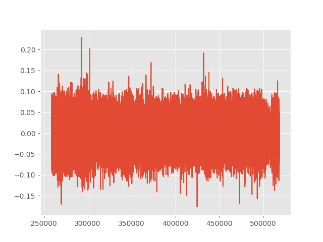

# SyDOM
Sophisticated Scalper Bot for BitMEX using orders imbalance analysis

------------------------------------

Configuration

Just replace the key and secret fields with yours and adjust the number of contracts traded in sydom.py

Run `pip install -r requirements.txt`

------------------------------------

Execution

`python sydom.py`

During the first run, the script will automatically generate a model (if missing) based on the 3 previous days of price action. This model is retrained every day at 6:00 AM UTC. Basically, you don't have anything to do once the bot is launched...

------------------------------------

  

This is what you get at the end of each model generation. It helps to check if the model_thr setting value is optimum. You have to look for a level where the spikes are about to reverse. Generally, 0.05 for ETHUSD is fine... This value is in ABSOLUTE terms !

------------------------------------

SyDOM has a telegram community for discussions on using SyDOM Bot and automated trading on BitMex : https://t.me/sydombot

------------------------------------

Donations to allow further developments

BTC: 3BMEXbS4Neu5KwsiATuZVowmwYD3UPMuxo

------------------------------------

## Disclaimer
The article and the relevant codes and content are purely informative and none of the information provided constitutes any recommendation regarding any security, transaction or investment strategy for any specific person. The implementation described in the article could be risky and the market condition could be volatile and differ from the period covered above. All trading strategies and tools are implemented at the users’ own risk.
