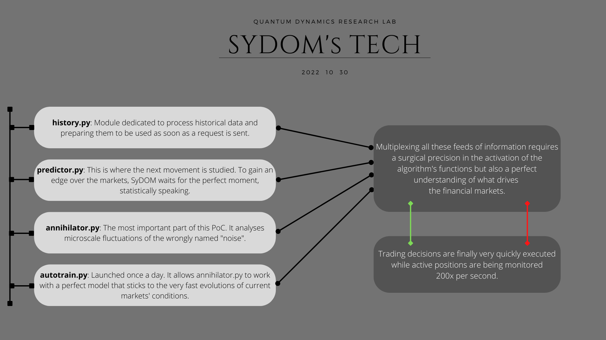

# SyDOM
Sophisticated Scalper Bot for BitMEX using orders imbalance analysis

  

------------------------------------

The idea behind this script is to spot micro-extremes (to the upside or the downside) and anticipate the reversal. To achieve that, it uses a modelisation of the market behaviour for the last 3 days (autogenerated) and applies a RSI computation onto the delta between the buyers and the sellers for the last 14 periods (each modification of the orderbook is counted as 1 period). As another filter, we use regular Bollinger Bands applied on an 5-minutes timeframe to avoid being caught in a defavorable jump. It works at the tick level and is best suited for ranging-type price action. Additionally, we recently implemented a machine-learning module on top of all of this to detect the trend we are in...

~~Warning : The daily model generation can take up to 2 hours. You can speed up the process by activating the `force_training` setting manually. In this case, the script focuses only on building a model and stops when it's done.~~

------------------------------------

Configuration

Use python 3.10

Replace the key and secret fields with yours and adjust the number of contracts traded in sydom.py

Run `pip install -r requirements.txt`

------------------------------------

Execution

`python sydom.py`

During the first run, the script will automatically generate a model based on the 3 previous days of price action (if you already have an updated daily model -> set `skip_initial_training` to True). This model is retrained every day at 6:00 AM UTC. Basically, you don't have anything to do once the bot is launched...

------------------------------------

  

The thresholds were defined through a manual analysis in the previous versions. All of these steps have now been automated !

------------------------------------

SyDOM has a telegram community for discussions on using SyDOM Bot and automated trading on BitMex : https://t.me/sydombot

------------------------------------

Donations to allow further developments

BTC: 3BMEXbS4Neu5KwsiATuZVowmwYD3UPMuxo

------------------------------------

## Disclaimer
The article and the relevant codes and content are purely informative and none of the information provided constitutes any recommendation regarding any security, transaction or investment strategy for any specific person. The implementation described in the article could be risky and the market condition could be volatile and differ from the period covered above. All trading strategies and tools are implemented at the users’ own risk.
